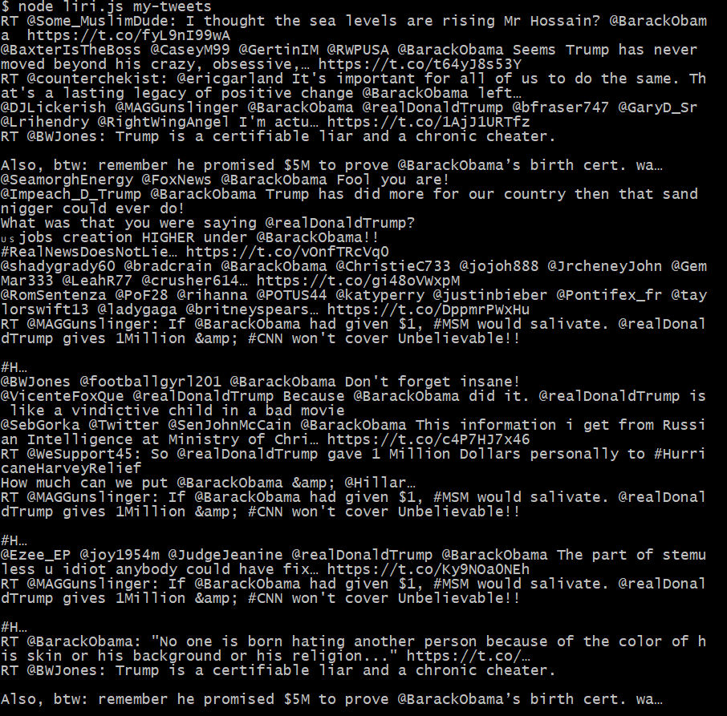
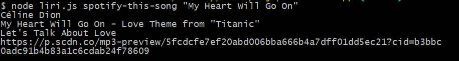
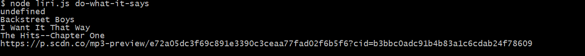

# liri-node-app
### Liri node is the app that is work like siri on the i phone phone taking command and display the results 
### add node liri.js my-tweets and it will display last 20 tweets 

### add node liri.js spotify-this-song and add the name of the song under quotation and hit enter it gone display information about the song

### add node liri.js movie-this and add the title of the movie under quotation and hit enter it gone display information about the movie

### add node liri.js do-what-it-says and hit enter it gone display the information of the music which it read from another file

